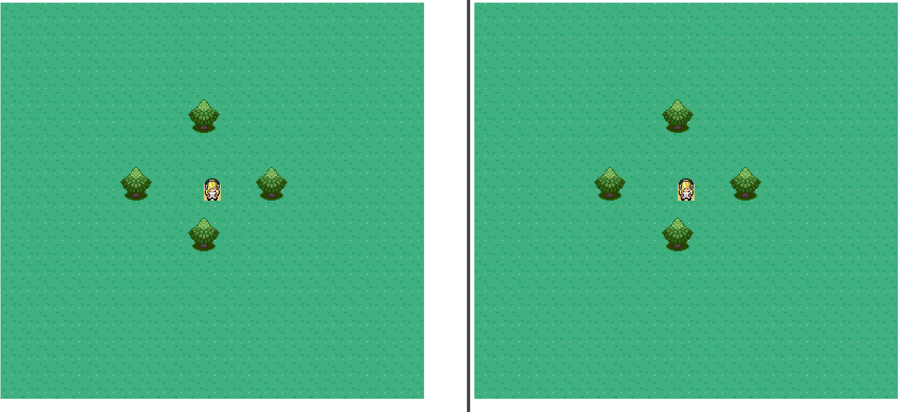

# Akkamon: a demo pokemon mmo written in Phaser3 typescript and Akka Java

> "One trainer is no trainer."

In akkamon the goal was to let many users interact with each other in parallel like in a typical MMO game, in this case we copy the pokemon formula and make it an MMO.

- [x] You can walk around the world and see your friends walking
- [x] You can invite your friend to start an interaction with you
- [x] You can start a battle with somebody else that is online
- [ ] You can actually play the pokemon battle (UNDER CONSTRUCTION)

Like the actual battle, many things that you would expect from a pokemon MMO were not within the scope of the project. The Game Engine [^Not completely from scratch, but I had to add stuff to connect it with the Websockets communication.], User Interface, Websockets API, and Actor model backend had to written from scratch, which took a lot of time.

# Install

# Start playing

# Tests (or lack thereof)
