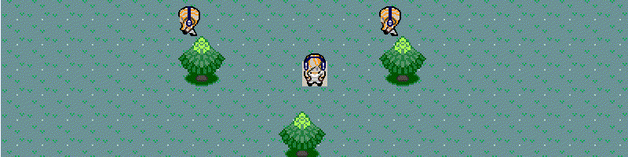

| |
| ----------- |
| |
| |
| |
| |
| |
| |
| |
| |
| |
| Akkamon: hoe we een mmo kunnen maken met akka en phaser3   |
| |
| |
| |
| |
| |

---


Hoe maak je eigenlijk een mmo? Wat is eigenlijk een mmo?

---


Hoe maak je eigenlijk een mmo?

* Veel spelers tegelijk laten bewegen in de wereld
* Spelers een interactie met elkaar laten aangaan
* Een spel

> Een spel waar veel dingen tegelijk moeten gebeuren, en veel communicatie tussen client en backend.

* Een spel:                 Phaser3, een javascript/typescript framework
* Veel communicatie:        Websockets
* Veel dingen tegelijk:     Java Akka, strongly typed actor systeem

---

# Akka en actors introductie
## What is an actor? A computation unit in and of itself

> " The actor is a fundamental unit of computation. It has to embody three things:
* processing - because you gotta get something done
* storage - because you have to be able to remember things
* and, communications"


- Carl Hewitt, creator of the actor model, very smart old guy

from very cool and funny talk: [The Actor Model (everything you wanted to know, but were afraid to ask)](https://channel9.msdn.com/Shows/Going+Deep/Hewitt-Meijer-and-Szyperski-The-Actor-Model-everything-you-wanted-to-know-but-were-afraid-to-ask)

---

# Actors don't come alone, they come in a system

> "One ant is no ant."

* In het systeem is alles een actor

* Elke actor heeft een eigen address in het systeem

* Een actor kan een bericht sturen naar een actor met een address in het systeem

```
--> Een actor heeft een mailbox waar hij berichten kan ontvangen
```


```actor
                       ┌──────┐      bericht   ┌──────┐
                       │Actor1│ ------> ------>│Actor2│
                       └──────┘                └──────┘
```

>  Is de mailbox ook een actor? Nee

---

# Hoe werkt het precies?


Wat kan een actor precies wanneer een bericht ontvangen wordt??:

I. Hij kan een nieuwe actor maken/spawnen


```
 bericht ┌──────┐             ┌────────┐
-------->│Actor1│ .spawn ---> │newActor│
         └──────┘             └────────┘
```

II. Hij kan een nieuw berict sturen naar een actor die hij kent (in een HashMap bijv.)

```
 bericht ┌──────┐       bericht ┌─────────────┐
-------->│Actor1│ .tell ------> │bekendeActor │
         └──────┘               └─────────────┘
```

III. Hij kan opgeven wat hij met volgende berichten gaat doen (denk gedrag van een object)

```
 bericht  ┌──────────┐                    ┌─────────┐
--------> │blijeActor│ .behaviorBoos ---> │bozeActor│ <- (zelfde actor reageert nu boos op berichten)
          └──────────┘                    └─────────┘
```

---

# Conceptueel gezien wordt 1 bericht per keer afgehandelt

* Berichten versturen kan behandelt worden als *"Fire and Forget"*
    * de verzender kan gelijk iets anders doen
    * de ontvanger handelt het bericht pas af wanneer hij er klaar voor is

```


            bericht4
            bericht3                                      bericht4
            bericht2                                      bericht3
            bericht1                                      bericht2
           ┌───────┐                                     ┌───────┐
 bericht4  │mailbox│┌──────────┐                         │mailbox│┌──────────┐
-------->  └───────┘     Actor │ .handelBericht1Af --->  └───────┘     Actor │ ---> ...
           └───────────────────┘                         └───────────────────┘
```

---

# Wat is het voordeel van het Actor Systeem? No channel, no overhead! Fast parallelism

* Geen intermediary stap tussen processen! Data kan snel tussen verschillende processen
uitgewisseld worden.

    * Geen zorgen over channel overhead en logica
    * Geen two fase commit bijvoorbeeld (GET, PUT)


* Abstractie laag dat parallelisme developpen "super" makkelijk maakt

    - geen lowlevel geneuzel met locks, queues, en andere implementatie details
    * makkelijke optimalisatie voor distributed computing

---

# Sidenote: Programs, processes, and threads

[Threads vs. processes](https://www.backblaze.com/blog/whats-the-diff-programs-processes-and-threads/)

---

# And there is more! Dingen die ik niet veel gebruikt heb!

* Futures/ berichten naar de toekomst versturen. Denk aan javascript promises:

```js
let theFuture = () => { new Promise(resolve => {setTimeout(resolve, 1000)} ) }
await theFuture();
```

* _Many to many_ relaties tussen actors en hun adressen

* Berichten ensurance of arrival

* Non- determinisme (Uitkomst van systeem hangt af van factoren buiten het systeem)

* Synchronisation en mutability van data (built-in alleen, de 1 message at a time regel)

* Clusters en sharding voor distributed computing

* Persistence en database koppeling met event sourcing

* Other things?

> " This is the end. Nobody could ever conceive of a model of computation beyond that of the Turing machine. "

---

# Samenvatting

* Actors kunnen eigenlijk* maar drie dingen: spawn, tell, en Behavior veranderen

*Over-simplificatie, afhankelijk van de implementatie is meer mogelijk

---

# Java Akka typed actor programming language

## Voorbeeld: Een actor (systeem) maken met het ask patroon

* Stel we hebben twee Actors: Marco en Bart

```java
class Marco {
}

class Bart {
}
```

* Allebei kunnen ze een type bericht ontvangen

```java
class Marco extends AbstractBehavior<Marco.Bericht> {
    public interface Bericht {} // bericht type wat Marco kan ontvangen


    public static Behavior<Marco.Bericht> create() { // Maak een marco actor referentie
        return Behaviors.setup(context -> new Marco(context));
    }

    public Marco(ActorContext<Bericht> context) {super(context)} // Maak een Marco object

    @Override
    public Receive<Bericht> createReceive() { // Wat doe ik als ik een bericht ontvang?
        return newReceiveBuilder()
                .build();
    }
}

class Bart // zelfde verhaal
```

---

# Voorbeeld: Een actor (systeem) maken met het ask patroon

* In ons geval begint het systeem wanneer Marco klaar is met een grote Aurorus refactor

```java
public static main(String[] args) {
    ActorRef<Marco.Bericht> marco = ActorSystem.create(Marco.create(), "aurorus-refactor-systeem");
}
```

* Wanneer het systeem start maakt Marco een Bart actor (niet super realistisch) en vraagt hem om een Code Review te doen

```java
[..]
public Marco() {
    ActorRef<Bart.Bericht> bart = getContext().spawn(Bart.create(), "bartsNaam");
    final Duration timeout = Duration.ofSeconds(10);
    // ask en tell zijn belangrijk
    context.ask(
            Bart.isKlaarMetCodeReview.class,    // Verwacht deze reactie
            bart,                               // vraag het aan bart
            timeout,                            // hoe lang heeft bart om te reageren?
            (ActorRef<Bart.isKlaarMetCodeReview> ref) -> new Bart.reviewMijnCodeAlsjeblieft(ref), // welke vraag stuur ik
            (reactie, throwable) -> {
                if (reactie != null) {
                    return new MarcoBegrijptReactieZo(reactie.string);
                } else {
                    return new MarcoBegrijptReactieZo("Er ging iets fout!");
                }
            }
    );
}
[..]
```

---

# Voorbeeld: een actor dat van gedrag verandert na een bericht

* Als je bart vraagt om een code review terwijl hij al bezig is reageert hij anders:

```terminal20
bash -c "gradle :domain:BartMarco"
```

---

# Wat gebeurde er net?

* Toen Bart de eerste code review vraag ontving van Marco veranderde hij zijn gedrag naar *"ben al bezig"*.

```java
class Bart ...
[...]
   @Override
    public Receive<Bart.Bericht> createReceive() {
        return newReceiveBuilder()
                .onMessage(Bart.reviewMijnCodeAlsjeblieft.class, this::reviewMarcosCode)
                .build();
    }

    private Behavior<Bericht> bezigMetCodeReview() {
        return newReceiveBuilder()
                .onMessage(Bart.reviewMijnCodeAlsjeblieft.class, this::benAlBezig)
                .build();
    }

    private Behavior<Bericht> reviewMarcosCode(reviewMijnCodeAlsjeblieft codeReviewVraag) {
        getContext().getLog().info("Bart ontvangt vraag van Marco en begint met code review, en stuurt een reactie als hij klaar is.");
        stuurEenReactieWanneerIkKlaarBen();
        return bezigMetCodeReview(); // <------------ Gedrag wordt verandert naar "ben al bezig"!
    }

    private Behavior<Bericht> benAlBezig(reviewMijnCodeAlsjeblieft codeReviewVraag) {
        getContext().getLog().info("Bart ontvangt tweede keer de vraag van Marco en reageert nu gelijk.");
        codeReviewVraag.replyTo.tell(new isKlaarMetCodeReview("Ben al bezig met de code review."));
        return this;
    }
[...]
```

---

# Samenvatting

* Ons systeem

```

                             ┌─────┐   ReviewMijnCodeAlsjeblieft    ┌─────────────────────┐
                             │Marco│ --->                      ---> │Bart (Niet bezig)    │
                             └─────┘                                └─────────────────────┘
                                  |                                        \
                                  |                                         \
                                  .                                   ┌─────────────────────┐
                                   \                                  │Bart (Ben al bezig)  │
                                    \                                 └─────────────────────┘
                                     \                                   /
                                      \                                 / wanneerIkKlaarBen
                                       .<--Ben klaar met de review! <--.


                             ┌─────┐   ReviewMijnCodeAlsjeblieft    ┌─────────────────────┐
                             │Marco│ --->                      ---> │Bart (Ben al bezig)  │
                             └─────┘                                └─────────────────────┘
                                     \                                   /
                                      \                                 / gelijk
                                       <---       Ben al bezig!    <---.

```

* Actor berichten zijn data objecten welke een interface implementeren dat aangeeft naar welke actor het gestuurd kan worden

* Actor berichten kunnen met .tell() en .ask() worden gecommuniceerd

* Actor gedrag kan veranderen door een .onMessage functie een andere behavior te laten returnen

> Bart gaat niet terug naar de niet bezig staat in ons voorbeeld systeem, hoe zouden we Barts gedrag kunnen veranderen naar niet bezig?

---

# Het actor systeem van akkamon
## Spelers laten bewegen in de wereld



* TrainerID, Direction enum en TilePos data

```java
                     class TrainerID {                  enum Direction {                   class TilePos {
                         String id;                         UP,                                int x;
                         String scene;                      DOWN,                              int y;
                     }                                      LEFT,                          }
                                                            RIGHT,
                                                            NONE
                                                        }
```

* Movement berichten

```java
            class RequestStartMoving {                       class RequestStopMoving {    class RequestNewTilePos {
                long requestId;                                  ...same as start             long requestId;
                TrainerID trainerID;                         }                                TrainerID trainerID;
                Direction direction;                                                          TilePos tilePos;
                ActorRef<AkkamonNexus.Command> replyTo;                                       ActorRef<AkkamonNexus.Command> replyTo;
            }                                                                             }
```

> Naar welke actor gaan deze berichten?

---

# Hoe gaan we van Direction input naar spelers bewegen?

## Direction Queue's sturen met HeartBeats

> Start timer voor 200ms, als de tijd voorbij is dan vraag je om een HeartBeat

```
                                                    ┌─────┐
                                                    │Nexus│
                                                    └─────┘
                                                  /    |
                                                 .     .  <- Map<sceneId, actor>
                                                 |     |
                                            ┌─────┐
                                            │Scene│    ...
                                            └─────┘
                                           /   |
                                          .    .  <- Map<TrainerID, actor>
                     ┌─────────┐          |    |
                     │MoveQueue│┌──────────┐
                     └─────────┘   Trainer │   ...
                     └─────────────────────┘
```

---

```
                                        speler begint naar boven te bewegen

                                                       |
                                                       |
                                                      \|/
                                                       .
                                                       tell(StartMovingRequest)
                                                       |
                                                      \|/
                                                       .
                                                    ┌─────┐
                                                    │Nexus│
                                                    └─────┘
                                                  /    |
                                                 .     .
                                                 |     |
                                            ┌─────┐
                                            │Scene│    ...
                                            └─────┘
                                           /   |
                                          .    .
                     ┌─────────┐          |    |
                     │MoveQueue│┌──────────┐
                     └─────────┘   Trainer │   ...
                     └─────────────────────┘
```

---

```
                                                    ┌─────┐
                                                    │Nexus│
                                                    └─────┘
                                                  /    |
                                                 .     .
                                                 |     |
                                            ┌─────┐
                                            │Scene│    ...
                                            └─────┘
                                           /   |
                     Direction.UP         .    .
                     ┌─────────┐          |    |
                     │MoveQueue│┌──────────┐
                     └─────────┘   Trainer │   ...
                     └─────────────────────┘
```

---


```
                                        speler bereikt een nieuwe TilePos

                                                       |
                                                       |
                                                      \|/
                                                       .
                                                       tell(NewTilePosRequest)
                                                       |
                                                      \|/
                                                       .
                                                    ┌─────┐
                                                    │Nexus│
                                                    └─────┘
                                                  /    |
                                                 .     .
                                                 |     |
                                            ┌─────┐
                                            │Scene│    ...
                                            └─────┘
                                           /   |
                     Direction.UP         .    .
                     ┌─────────┐          |    |
                     │MoveQueue│┌──────────┐
                     └─────────┘   Trainer │   ...
                     └─────────────────────┘
```

---


```
                                                    ┌─────┐
                                                    │Nexus│
                                                    └─────┘
                                                  /    |
                                                 .     .
                                                 |     |
                                            ┌─────┐
                                            │Scene│    ...
                                            └─────┘
                     Direction.UP          /   |
                     Direction.UP         .    .
                     ┌─────────┐          |    |
                     │MoveQueue│┌──────────┐
                     └─────────┘   Trainer │   ...
                     └─────────────────────┘
```

---

# 200ms zijn voorbij

```
                                                Automatische timer

                                                       |
                                                       |
                                                      \|/
                                                       .
                                                       tell(HeartBeatRequest)
                                                       |
                                                      \|/
                                                       .
                         ┌─────┐<---.             ┌─────┐
                         │Query│     \            │Nexus│
                         └─────┘      .spawn      └─────┘
                                        (Query)    /    |
                                          \       .     .
                                           \      |     |
                                            ┌─────┐
                                            │Scene│    ...
                                            └─────┘
                     Direction.UP          /   |
                     Direction.UP         .    .
                     ┌─────────┐          |    |
                     │MoveQueue│┌──────────┐
                     └─────────┘   Trainer │   ...
                     └─────────────────────┘
```

---

# De laatste stap van het HeartBeat verhaal: stuur het op naar de client

```

                                    Verzend naar spelers en speel de moves af op het scherm
                                                     .
                                                    /|\
                                                     |
                                                     |
                         ┌─────┐                  ┌─────┐
                         │Query│-tell(HeartBeat)->│Nexus│
                         └─────┘       Response   └─────┘
                           |                       /    |
                           |                      .     .
                      Direction.UP                |     |
                      Direction.UP          ┌─────┐
                           .                │Scene│    ...
                          /|\               └─────┘
                           |                /   |
                           |               .    .
                     ┌─────────┐           |    |
                     │MoveQueue│┌──────────┐
                     └─────────┘   Trainer │   ...
                     └─────────────────────┘

```

> Hoe zouden we het systeem kunnen verbeteren?

---

# De laatste stap van het HeartBeat verhaal: stuur het op naar de client

```

                                    Verzend naar spelers en speel de moves af op het scherm
                                                     .
                                                    /|\
                                                     |
                                                     |
                         ┌─────┐                  ┌─────┐
                         │Query│-tell(HeartBeat)->│Nexus│
                         └─────┘       Response   └─────┘
                           |                       /    |
                           |                      .     .
                      Direction.UP                |     |
                      Direction.UP          ┌─────┐
                           .                │Scene│    ...
                          /|\               └─────┘
                           |                /   |
                           |               .    .
                     ┌─────────┐           |    |
                     │MoveQueue│┌──────────┐
                     └─────────┘   Trainer │   ...
                     └─────────────────────┘

```

> Hoe zouden we het systeem kunnen verbeteren?

* Synchronisatie stap toevoegen met absolute TilePos coordinaten
* Validatie
* Persistence

---

# "Stap2": twee spelers een interactie laten aangaan met een handshake actor

* Als twee spelers een interactie aangaan moeten ze eerst allebei accepteren


* Eerst verstuurt een speler een interactie start naar de *Nexus* actor
* Dan maakt de nexus een handshake actor aan

```
┌─────┐                              ┌──────────┐
│Nexus│ ---> .spawn(HandShaker) ---> │HandShaker│ ---> wacht op spelers om te accepteren
└─────┘                              └──────────┘
```

* Als alle spelers hebben geaccepteerd, dan stuurt de handshaker een bericht terug naar de *Nexus*

```

┌──────────┐                                   ┌─────┐
│HandShaker│ ---> tell(HandShakeResponse) ---> │Nexus│ ---> begin een battle!
└──────────┘                                   └─────┘
```

> Wat als er iets mis gaat met de handshake?

---

# "Stap2": twee spelers een interactie laten aangaan met een handshake actor

* Als twee spelers een interactie aangaan moeten ze eerst allebei accepteren


* Eerst verstuurt een speler een interactie start naar de *Nexus* actor
* Dan maakt de nexus een handshake actor aan

```
┌─────┐                              ┌──────────┐
│Nexus│ ---> .spawn(HandShaker) ---> │HandShaker│ ---> wacht op spelers om te accepteren
└─────┘                              └──────────┘
```

* Als alle spelers hebben geaccepteerd, dan stuurt de handshaker een bericht terug naar de *Nexus*

```

┌──────────┐                                   ┌─────┐
│HandShaker│ ---> tell(HandShakeResponse) ---> │Nexus│ ---> begin een battle!
└──────────┘                                   └─────┘
```

> Wat als er iets mis gaat met de handshake?

* Ligt aan het interactie type
* Als iemand weigert en iedereen is nodig dan gaat het niet door

---

# "Stap3": Een Pokemon battle tussen twee spelers modelleren (UNDER CONSTRUCTION)

* Als de battle begonnen is kennen twee trainers een Battle actor!

```
                                 .                         .
                                 .                         .
                                 .                         .
                             ┌────────┐                ┌────────┐
                             │Trainer1│                │Trainer2│
                             └────────┘                └────────┘
                                 \                        /
                                  .       ┌──────┐       .
                                    ------│Battle│------
                                          └──────┘
```

* Het gedrag van de trainers is ook verandert naar *inBattle*, ze doen niks meer met movement Berichten

* Het idee is om een state/data object en een queue van user-interface events terug te sturen naar de Client

```java
// gaat naar de client vanaf de actor              // User interface events
class BattleMessage {                              enum BattleEventIds {
                                                       INTRODUCTION,
                                                       FIGHT //?(UNDER CONSTRUCTION)
    Queue<BattleEvent> eventsToPlay;               }
    BattleState state;

    public BattleMessage(
            AkkamonNexus.TrainerID trainerID,
            BattleEvents events,
            BattleState state
            ) {
        this.eventsToPlay = events
                        .trainerIDEventMap
                        .get(trainerID);
        this.state = state;
    }
}
```

---

# Pokemon programmeren met OO

* Pokemon zijn eigenlijk:
    - nummers/ stats
    - een type
    - een ability
    - statussen
    - vier moves

```java
    private String name;
    private MonStats stats;
    private Type type;
    private Ability ability;
    private Map<StatusCategory, List<Status>> status;
    private Map<MoveSlot, Move> moves;

    public Mon(String name, MonStats stats, AkkamonType typeName, AkkamonAbilities abilityName, AkkamonStatus[] statusNames, String[] moveNames) {
        this.name = name;
        this.stats = stats;
        this.type = new TypeFactory().fromName(typeName);
        this.ability = new AbilityFactory().fromName(abilityName);
        this.status = new StatusFactory().fromNames(statusNames);
        this.moves = new MovesFactory().fromNames(moveNames);
    }
```

* Elke van bovengenoemde heeft potentieel een behaviour in een beurt, ze moeten voldoen aan een interface ten minste, dit is wat ik nu denk dat er kan gebeuren in een beurt, moet nog argumenten opschrijven, waarschijnlijk de eventsToPlay en State van vorige slide.

```java
public interface Phases {
    void fight();
    void getAttacked();
    void useItem();
    void switchOut();
    void switchIn();
}
```

---

# Demo time


```
         █      █
    ██   █      █
    ██   █      █
   ▒██▒  █  ▒█  █  ▒█  ░███░  ██▓█▓   ███   █▒██▒
   ▓▒▒▓  █ ▒█   █ ▒█   █▒ ▒█  █▒█▒█  █▓ ▓█  █▓ ▒█
   █░░█  █▒█    █▒█        █  █ █ █  █   █  █   █
   █  █  ██▓    ██▓    ▒████  █ █ █  █   █  █   █
  ▒████▒ █░█░   █░█░   █▒  █  █ █ █  █   █  █   █
  ▓▒  ▒▓ █ ░█   █ ░█   █░ ▓█  █ █ █  █▓ ▓█  █   █
  █░  ░█ █  ▒█  █  ▒█  ▒██▒█  █ █ █   ███   █   █
```
